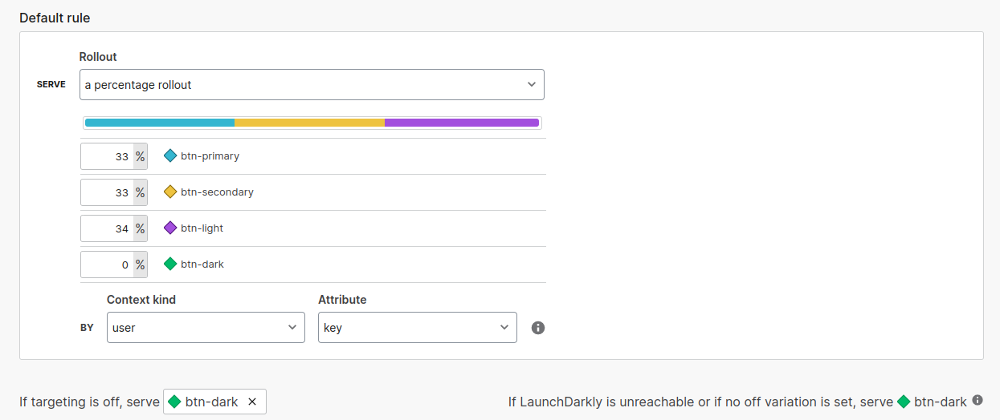
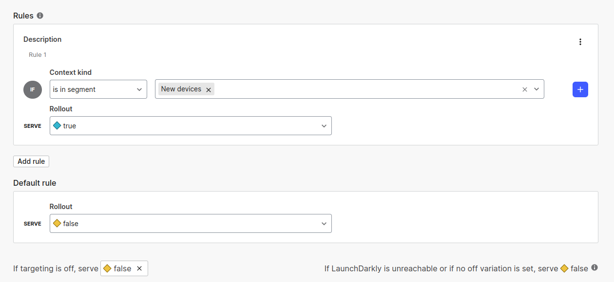
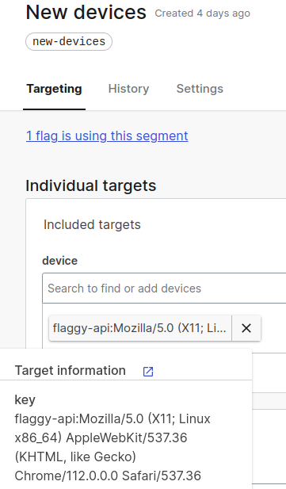
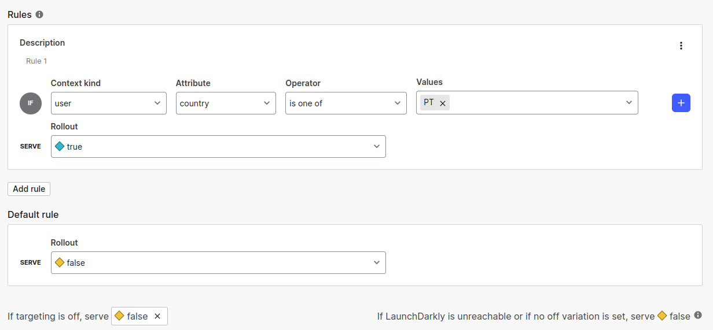

# Aspnet API with LaunchDarkly SDK

This project integrates a simple `aspnet` API with the LaunchDarkly SDK. The objective is to understand how it works, what features are present and the limitations.

LaunchDarkly is a cloud hosted Feature Management solution that offers a trial version for new users. The project was created and tested during the trial but it's possible to run the project and see the feature flags working [loading the flags from a file](https://docs.launchdarkly.com/sdk/features/flags-from-files) (which is the way recommended for local development).

The file `ld-flagdata.json` was retrieved from the `latest-all` endpoint:

```sh
curl -H "Authorization: SDK-KEY" https://sdk.launchdarkly.com/sdk/latest-all > flagdata.json
```

## The project

The app was created with aspnet and razor pages, to allow to test and visualize the features provided by LaunchDarkly like segmentation and percentage rollout.


To run the project using docker compose:

```sh
docker compose up app
```

The app can be accessed at:

- Home: http://localhost:5238
- Swagger: http://localhost:5238/swagger

## Important stuff

- How to create a key: Keys must be searchable and unique. The [docs](https://docs.launchdarkly.com/home/contexts/built-in-attributes) suggest "we suggest adding a searchable term to the beginning of the key, followed by a unique ID".

- LaunchDarkly Server SDK loads all the flags at the startup of the app and the changes are syncronized using [Server-Sent Events](https://docs.launchdarkly.com/sdk/concepts/client-side-server-side#receiving-updates-from-launchdarkly). With lots of feature flags for the same project it's possible that the startup time increases.

- For tests, [there is a solution](https://docs.launchdarkly.com/sdk/features/test-data-sources#net-server-side) better than simply loading from a file. Using `TestData` source is possible to change the value programmaticaly.

## Feature flags:

- ButtonSchemeValue - String variation with percentage rollout



- AddPost - boolean variation that targets a segment



The segment `new-devices` is configured as bellow:



- ShowTags - boolean variation that targets an attribute of the user


